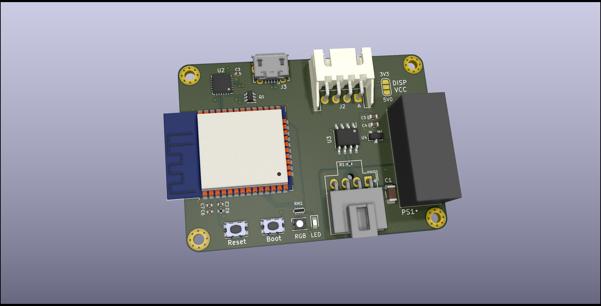

# EltekController

This is a little board I whipped up to connect to my [Eltek Flatpack2 Breakout Board](https://github.com/neg2led/EltekFlatpack2) but it should be useful as a general CANBUS control board with wide voltage input.

Board uses a standard SIP8-ish isolated DC-DC converter module, there's a lot of these to choose from. Most of the parts on the board are outfitted with their LCSC code for KiKit's JLCPCB SMT fab autogeneration.

Designed to be used either via a WiFi/Bluetooth remote interface, with a Nextion HMI, or a cheap I2C OLED (if single-button control with just a status readout is all you need).

I've probably made some really bad design choices here, please don't judge me.

## Repository Structure
- `EltekController` contains the main schematics and board drawing
- `EltekControllerS/EltekController.pretty` contains the board-specific footprints

## Building
Simply call `make` in the top-top level directory. The `build` directory will then contain:

- the main board
- A panelized version of said board
- zipped gerbers for the boards you can directly use for manufacturing
- zipped gerbers and SMT assembly BOM/position files for JLCPCB's SMT assembly service for the single-board version.

Makefile uses [Jan Mrázek](https://github.com/yaqwsx)'s [KiKit](https://github.com/yaqwsx/KiKit), which I cannot recommend enough, and therefore has to be available on your system.

Jan's [jlcparts](https://yaqwsx.github.io/jlcparts/) app was also extremely useful in narrowing down part choices based on what JLCPCB have available.

-----
### **IMPORTANT NOTE:** If you give JLCPCB these files as-is, *please* verify the orientation of every part before submitting.
